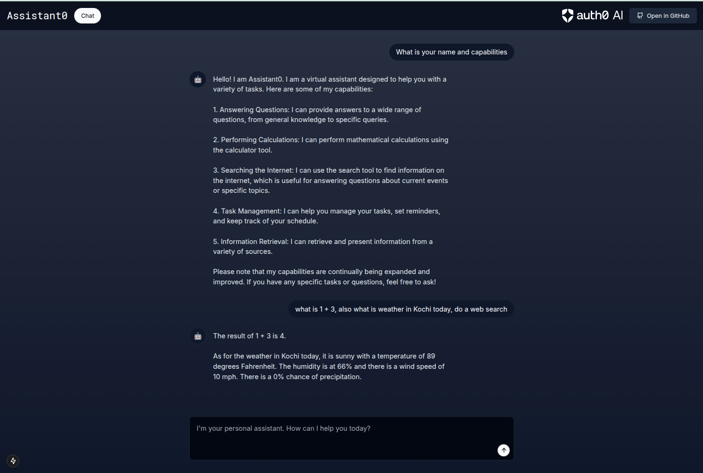

# Agentic AI Demo

A trimmed-down version of the original Assistant0 template that keeps only the pieces you need for a quick demo:

- **Frontend:** a single Next.js page with a friendly chat interface.
- **Backend:** a lightweight LangChain-powered agent exposed at `POST /api/chat`.
- **No auth, no database, no Docker.** Just bring your OpenAI API key and start chatting.



## Getting Started

1. Install dependencies:

   ```bash
   npm install
   ```

2. Add your OpenAI API key to a `.env.local` file:

   ```bash
   echo "OPENAI_API_KEY=sk-..." > .env.local
   ```

3. Run the development server:

   ```bash
   npm run dev
   ```

4. Open <http://localhost:3000> and start chatting with the agent.

## Project Structure

- `src/app/page.tsx` – renders the chat experience.
- `src/components/chat-window.tsx` – manages chat state and requests.
- `src/lib/agent.ts` – defines the LangChain agent used by the API route.
- `src/app/api/chat/route.ts` – serverless endpoint that calls the agent.

Feel free to build on top of this minimal foundation for your own demos.
